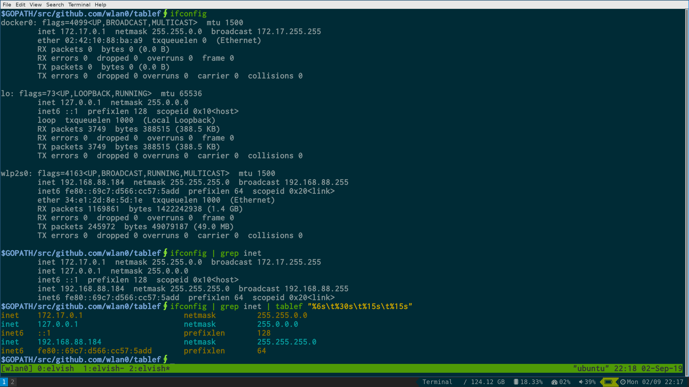

Tablef
------

Tablef is a command line tool which prints input data in tabular view.



### Usage
-----------

Install tablef

#### Linux

```bash
$> curl -s https://api.github.com/repos/wlan0/tablef/releases/latest \
	| jq -r ".assets[0].browser_download_url" \
	| xargs wget -qO- \
	| tar -xzf - releases/tablef-linux-amd64 --strip-components=1; echo "tablef installed to /usr/local/bin/tablef"; sudo ./tablef-linux-amd64
```

#### OSX

```bash
$> curl -s https://api.github.com/repos/wlan0/tablef/releases/latest \
	| jq -r ".assets[0].browser_download_url" \ 
	| xargs wget -qO- \
	| tar -xzf - releases/tablef-darwin-amd64 --strip-components=1; echo "tablef installed to /usr/local/bin/tablef"; sudo ./tablef-darwin-amd64
```

Use it

```bash
$∮ ifconfig | grep inet
        inet 172.17.0.1  netmask 255.255.0.0  broadcast 172.17.255.255
        inet 127.0.0.1  netmask 255.0.0.0
        inet6 ::1  prefixlen 128  scopeid 0x10<host>
        inet 192.168.88.184  netmask 255.255.255.0  broadcast 192.168.88.255
        inet6 fe80::69c7:d566:cc57:5add  prefixlen 64  scopeid 0x20<link>
$∮ ifconfig | grep inet | tablef "%6s\t%30s\t%15s\t%15s"
inet    172.17.0.1                      netmask         255.255.0.0    
inet    127.0.0.1                       netmask         255.0.0.0      
inet6   ::1                             prefixlen       128            
inet    192.168.88.184                  netmask         255.255.255.0  
inet6   fe80::69c7:d566:cc57:5add       prefixlen       64             
```
